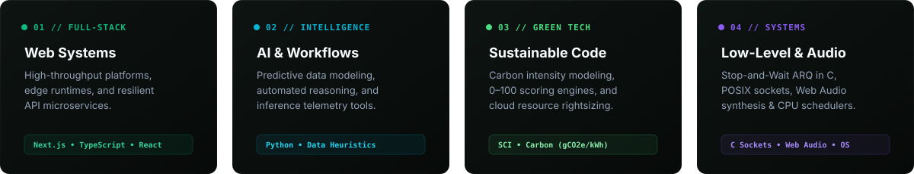

<div align="center">
  
</div>

<br />

<div align="center">
  <p align="center">
    <a href="https://github.com/LijoPaul-006">
      
    </a>
    <a href="https://github.com/LijoPaul-006/Just4U">
      
    </a>
    <a href="mailto:lijopaulme666@gmail.com">
      
    </a>
  </p>
  <h3><em>"Building software systems, intelligent workflows, and hardware-driven architectures that turn ambitious ideas into production-grade products."</em></h3>
</div>

<br />

---

## 🛠️ System Architectures & What I Build

<div align="center">
  
</div>

<br />

---

## 🌟 Featured Engineering Projects

<br />

<!-- PROJECT 1: JUST4U -->
<a href="https://github.com/LijoPaul-006/Just4U">
  
</a>

> *"Everything students need. One place."*

Just4U is a verified student ecosystem that brings academic resources, student discovery, study partners, travel buddies, event companions, digital student ID, college documents and other everyday student utilities into one personalized platform.

- **Key Capabilities**:
  - 🎓 **Verified Student Identity**: Authenticated collegiate domain verification (`@btech.christuniversity.in`) with real-time OTP issuance and secure JWT cookie sessions.
  - 🤝 **Skill-Based Teammate Finder**: Multi-attribute compatibility matching across programming languages, project stacks, and graduation years.
  - 📚 **Academic Resource Hub**: Centralized, filterable catalog of previous-year question papers (PYQs) with PDF previews and download tracking.
  - 🧠 **AI Topic Explainer**: Syllabus concept break-down offering analogies, mathematical proofs, exam-oriented rubrics, and interactive quizzes.
  - 👥 **Study Partner Finder**: Syllabus-aligned study buddy discovery matching compatible study styles (Deep Focus, Discussion, Problem Solving).
  - 🚍 **Privacy-Conscious Travel Buddy**: Metro and bus transit corridor co-traveler matching without exposing private residential addresses.
  - 🎟️ **Event Buddy**: Campus fests, hackathons, and symposium discovery with built-in companion matching so students never attend events alone.
  - 🪪 **Digital Student ID**: Holographic 3D card tilt with cryptographic anti-tamper QR pass and library barcode.
  - 📄 **College Documents & Forms**: Searchable clearinghouse of official university forms with required attachment guidelines.
  - 🛡️ **Admin Control System**: Role-guarded administration portal for curriculum management and campus safety moderation.
- **Tech Stack**: `Next.js 15 (App Router)` `React 19` `TypeScript 5` `Tailwind CSS` `Framer Motion` `JWT Auth` `Atomic Store`
- **Access**: 🌐 **[Live Demo](https://just4u.vercel.app)** &nbsp;|&nbsp; 📦 **[Repository](https://github.com/LijoPaul-006/Just4U)**

<br />

<!-- PROJECT 2: MANIFESTO -->
<a href="https://lijopaul-006.github.io/manifesto/">
  
</a>

> *"You write the person you want to become — then build your life toward that declaration."*

- **Architecture**: Private personal-growth operating system centered around identity declaration, reflective journaling, identity-linked goals, time capsules, evidence-based insights, and a context-grounded AI Future Self persona.
- **Capabilities**: Declarative 7-step onboarding, Future Self persona generation, Talk to Future You chat workspace with vector cosine memory retriever, 2-minute daily evening reflection, sealed time capsules with locked server-side protection, becoming timeline documentary, and memory sovereignty controls.
- **Tech Stack**: `Next.js 14 (App Router)` `TypeScript 5.5` `Tailwind CSS` `Prisma ORM` `SQLite / PostgreSQL` `Vitest` `GitHub Actions`
- **Access**: 🌐 **[Live Application](https://lijopaul-006.github.io/manifesto/)** &nbsp;|&nbsp; 📦 **[Source Code](https://github.com/LijoPaul-006/manifesto)** &nbsp;|&nbsp; 🏷️ **[v1.0.0 Release](https://github.com/LijoPaul-006/manifesto/releases/tag/v1.0.0)**

<br />

<!-- PROJECT 2: VERDANT -->
<a href="https://lijopaul-006.github.io/Verdant/">
  
</a>

> *"Measure software. Understand impact. Build greener software."*

- **Architecture**: Production-grade full-stack Software Sustainability Intelligence Platform that calculates a deterministic **0–100 Sustainability Score** across 6 multi-factor architectural dimensions (Energy, Compute, Memory, Network, Storage, Carbon).
- **Capabilities**: Real-time **What-If Simulation Engine**, 7-step progressive telemetry calculator, sprint timeline benchmarks ($v1.0 \to v1.1 \to v1.2$), and print/PDF audit reports.
- **Tech Stack**: `Next.js 14 (App Router)` `TypeScript 5.5` `Tailwind CSS` `Prisma ORM` `Vitest` `GitHub Actions`
- **Access**: 🌐 **[Live Platform](https://lijopaul-006.github.io/Verdant/)** &nbsp;|&nbsp; 📦 **[Source Code](https://github.com/LijoPaul-006/Verdant)**

<br />

<!-- PROJECT 3: AURA MUSIC OS -->
<a href="https://lijopaul-006.github.io/aura-music-os/">
  
</a>

> *"Next-generation spatial audio workstation and interactive web OS interface."*

- **Architecture**: Browser-native spatial audio workstation and operating system interface built on the Web Audio API audio graph with real-time frequency visualizers.
- **Capabilities**: Multi-window audio management, signal synthesis with dynamic gain/panning nodes, spectrum analyzers, and state persistence.
- **Tech Stack**: `Next.js 16 (Turbopack)` `React 19` `TypeScript` `Web Audio API` `Zustand` `Tailwind CSS 4`
- **Access**: 🌐 **[Live Preview](https://lijopaul-006.github.io/aura-music-os/)** &nbsp;|&nbsp; 📦 **[Source Code](https://github.com/LijoPaul-006/aura-music-os)**

<br />

<!-- PROJECT 4: 3D ACADEMIC PORTFOLIO -->
<a href="https://lijopaul-006.github.io/3d-academic-portfolio/">
  
</a>

> *"Cinematic engineering portfolio with real-time 3D graphics and glassmorphism."*

- **Architecture**: High-performance 3D canvas portfolio platform powered by Three.js shaders, React Three Fiber, and hardware-accelerated micro-animations.
- **Capabilities**: Real-time WebGL Aurora shaders, glassmorphic depth layers, smooth Lenis momentum scrolling, and responsive viewport geometry.
- **Tech Stack**: `Vite 8` `React 19` `Three.js` `React Three Fiber` `GSAP` `Framer Motion` `Tailwind CSS 4`
- **Access**: 🌐 **[Live Preview](https://lijopaul-006.github.io/3d-academic-portfolio/)** &nbsp;|&nbsp; 📦 **[Source Code](https://github.com/LijoPaul-006/3d-academic-portfolio)**

<br />

<!-- PROJECT 5: CPU SCHEDULING STUDIO -->
<a href="https://lijopaul-006.github.io/cpu-scheduling-studio/">
  
</a>

> *"Interactive CPU process scheduling and virtual memory allocation simulator."*

- **Architecture**: Interactive operating systems simulation studio that constructs real-time animated Gantt charts and performance telemetry for scheduling algorithms.
- **Capabilities**: FCFS, SJF (Preemptive & Non-Preemptive), Round Robin with dynamic Time Quantum, and comparative Average Turnaround Time (TAT) computation.
- **Tech Stack**: `JavaScript (ES6+)` `HTML5 Canvas` `CSS3 Glassmorphic UI` `IBM Plex Mono`
- **Access**: 🌐 **[Live Preview](https://lijopaul-006.github.io/cpu-scheduling-studio/)** &nbsp;|&nbsp; 📦 **[Source Code](https://github.com/LijoPaul-006/cpu-scheduling-studio)**

<br />

<!-- PROJECT 6: STOP-AND-WAIT ARQ SIMULATION -->
<a href="https://lijopaul-006.github.io/computer-networks-arq/">
  
</a>

> *"Socket programming, frame transmission and packet-loss simulation in C."*

- **Architecture**: Dual-layer networking lab featuring an interactive web-based protocol pipeline visualizer alongside native POSIX C socket client/server binaries.
- **Capabilities**: Alternating sequence bit control ($0/1$), frame timeout timers, dynamic acknowledgement verification, and stochastic packet drop emulation ($0\%–60\%$).
- **Tech Stack**: `C (POSIX Sockets)` `Make` `JavaScript (ES6+)` `HTML5 Canvas` `CSS3 Design System`
- **Access**: 🌐 **[Live Preview](https://lijopaul-006.github.io/computer-networks-arq/)** &nbsp;|&nbsp; 📦 **[Source Code](https://github.com/LijoPaul-006/computer-networks-arq)**

<br />

<!-- PROJECT 7: THE SILENT LOVE -->
<a href="https://lijopaul-006.github.io/the-silent-love/">
  
</a>

> *"An immersive, distraction-free digital reading experience for an original novel."*

- **Architecture**: Editorial digital reading web application that surrounds the original manuscript with high-DPI vector rendering and distraction-free focus modes.
- **Capabilities**: PDF.js vector rendering engine, mobile touch swipe gestures, chapter quick-jump drawer, and LocalStorage reading position persistence.
- **Tech Stack**: `HTML5` `JavaScript (ES Modules)` `PDF.js v3.11` `CSS3 Luxury Editorial System`
- **Access**: 🌐 **[Live Preview](https://lijopaul-006.github.io/the-silent-love/)** &nbsp;|&nbsp; 📦 **[Source Code](https://github.com/LijoPaul-006/the-silent-love)**

<br />

---

## 💻 Engineering Stack & Toolkit

```text
┌─────────────────────────┬─────────────────────────────────────────────────────────────┐
│ Category                │ Technologies & Tools                                        │
├─────────────────────────┼─────────────────────────────────────────────────────────────┤
│ Languages               │ TypeScript • JavaScript (ESNext) • Python • C • SQL • HTML5 │
│ Frameworks & Runtimes   │ Next.js 16/14 • React 19 • Node.js • Express • Vite • Bun   │
│ Data & Persistence      │ PostgreSQL • SQLite • Prisma ORM • Redis                    │
│ 3D & Audio Systems      │ Three.js • React Three Fiber • Web Audio API • GSAP • Motion│
│ Styling & Design        │ Tailwind CSS 4/3 • Glassmorphism Tokens • CSS Custom Props │
│ DevOps & Quality        │ Git • GitHub Actions CI/CD • Linux / POSIX • Vitest • Docker│
└─────────────────────────┴─────────────────────────────────────────────────────────────┘
```

<br />

---

## 📊 GitHub Analytics & Productivity Metrics

<div align="center">
  <table border="0" cellspacing="0" cellpadding="0">
    <tr>
      <td align="center" valign="top">
        
      </td>
      <td align="center" valign="top">
        
      </td>
    </tr>
  </table>
  <br />
  
</div>

<br />

---

## 🔭 Currently Exploring & Engineering

- 🌿 **Green Software Foundation (GSF)**: Implementing real-time Software Carbon Intensity (SCI) telemetry and grid-aware execution scheduling.
- ⚡ **Edge Computing & WebAssembly**: Exploring sub-millisecond client-side compute runtimes for low-latency simulation engines.
- 🛠️ **Deterministic Developer Tooling**: Autonomous verification engines, AST static code analysis, and high-performance developer workflows.

<br />

---

## 📬 Connect & Collaborate

<table align="center" width="100%">
  <tr>
    <td align="center" width="25%">
      <a href="https://github.com/LijoPaul-006">
        <strong>GitHub</strong><br />
        <code>@LijoPaul-006</code>
      </a>
    </td>
    <td align="center" width="25%">
      <a href="https://www.linkedin.com/in/lijo-paul-a82a79315/">
        <strong>LinkedIn</strong><br />
        <code>Lijo Paul</code>
      </a>
    </td>
    <td align="center" width="25%">
      <a href="https://www.instagram.com/prince_lijo/">
        <strong>Instagram</strong><br />
        <code>@prince_lijo</code>
      </a>
    </td>
    <td align="center" width="25%">
      <a href="mailto:lijopaulme666@gmail.com">
        <strong>Email</strong><br />
        <code>lijopaulme666@gmail.com</code>
      </a>
    </td>
  </tr>
</table>

<br />

<div align="center">
  
</div>
